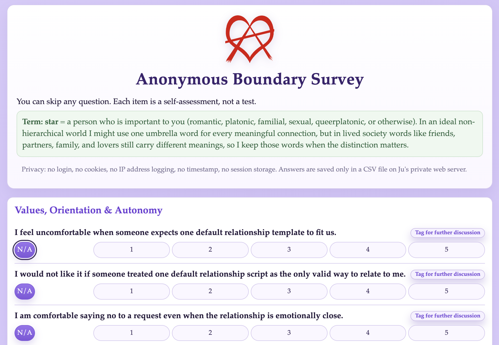

# Anonymous Boundary Survey

Small anonymous web survey for boundary reflection in RA and non-monogamy contexts.

## What This Project Is
- Static survey frontend in `index.html`
- Simple PHP submit endpoint in `submit.php`
- Static confirmation page in `thankyou.html`
- CSV storage in a private server directory outside web root

## Preview

## Data Model
Each submission writes one CSV row with:
- `q01` ... `q55`: Likert answers (`1..5`) or empty if unanswered
- `d01` ... `d55`: discussion tags (`1` = tagged, `0` = not tagged)

The CSV header is auto-created on first submission.

## Anonymity Model
This app is designed to avoid collecting personal identifiers in application code:
- No authentication
- No cookies set by this app
- No sessions
- No IP address fields stored in CSV
- No timestamp stored in CSV

Important caveat:
- Your web server (Apache/Nginx/hosting panel) may still keep access logs that include IP addresses and timestamps.
- If you want stronger anonymity, configure server logging policy appropriately on your host.

## Deployment (Shared Hosting + FTP)
This setup assumes a PHP-capable web host with a web root and a private data directory outside the web root.

Use these placeholders and replace them with your own host values:
- Web root: `/path/to/webroot/`
- Project folder inside web root: `/path/to/webroot/boundaries/`
- Private data dir outside web root: `/path/to/private-data-dir/`
- Public URL path: `https://your-domain.example/boundaries/`

### 1. Upload files
Upload these files to:
- `/path/to/webroot/boundaries/index.html`
- `/path/to/webroot/boundaries/submit.php`
- `/path/to/webroot/boundaries/thankyou.html`
- `/path/to/webroot/boundaries/RA_logo.svg`

### 2. Ensure private data directory exists
Create if missing:
- `/path/to/private-data-dir/`

### 3. Check permissions
`submit.php` needs write access to:
- `/path/to/private-data-dir/survey.csv`

The script will create `survey.csv` automatically on first submit.

### 4. Smoke test
1. Open your deployed survey URL
2. Submit one test response
3. Confirm redirect to `thankyou.html`
4. Confirm CSV appears in private data directory

## Usage Guidance
- Tell participants this is anonymous at app-level, with server-log caveat if relevant.
- Keep the participant pool small and informed (as intended).
- Avoid publishing raw CSV if responses could be identifying by context.

## Security Notes
- `submit.php` validates incoming values and writes with file locking.
- CSV is written outside web root by relative path traversal in code.
- There is no admin endpoint, results view, or export endpoint in this app.

## Quick Local Preview
You can preview layout locally by opening `index.html` directly in a browser.
`submit.php` requires a PHP-capable web server environment to process submissions.
